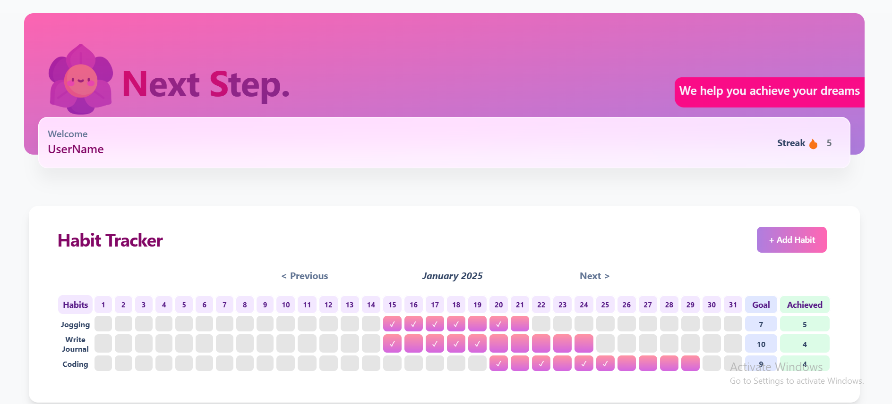
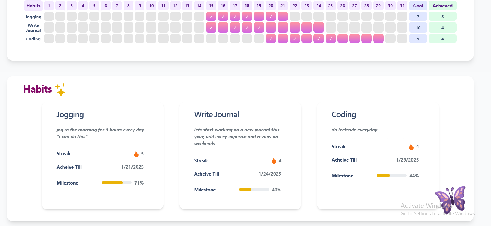
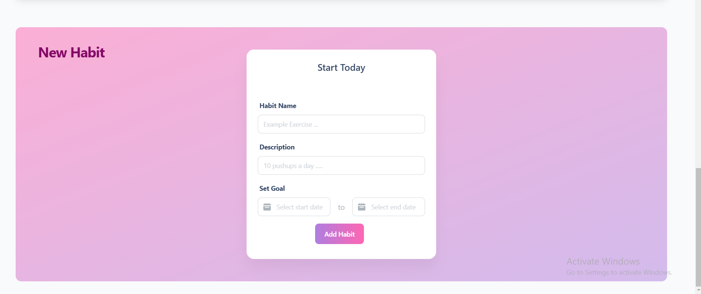

# NextStep

**Project Name:** NextStep  
**Created using GitHub Copilot in 24 hours**

## About the Project

NextStep is a habit builder and tracker website that helps users build and maintain good habits. Users can:

- **Add a Habit**: Users can input their desired habit.
- **Select Days**: Choose specific days of the week to practice the habit.
- **Track Progress**: The app generates a beautiful tracker graph for each habit. Users can click on the dates to confirm that they've completed the task, helping them maintain streaks and track achievements easily.

This project focuses on making habit tracking fun, easy, and visually appealing, ensuring that users stay motivated and accountable for their goals.

## Experience with GitHub Copilot

GitHub Copilot was incredibly helpful in building the front end of the NextStep project. Here's a breakdown of my experience:

- **Frontend Development**: Copilot made it super easy to write and alter code in Visual Studio. I was able to instantly select the part of the code I wanted to modify and get relevant solutions right away. The inline chat feature was a huge time-saver—no need to copy-paste code anymore! Instead, I could communicate directly with Copilot and get suggestions instantly.
  
  -- Workspace Efficiency: By using the "workspace" tag in the inline chat, I was able to apply changes across multiple files in seconds. This feature saved me a lot of time, as I didn't have to manually go through every file and make changes one by one.

  -- Overall Experience : GitHub Copilot helped me build the front end in the blink of an eye. The overall experience was fantastic, and I truly appreciate how seamless and efficient the workflow became with Copilot’s assistance.

### Suggested Improvement:
- If I select a portion of code for modification, it would be ideal if Copilot only made changes to that specific part. Currently, when using the inline chat, it sometimes uncomments lines of code, which isn't always necessary. This small tweak could make the process even more efficient.

## Media

# Project Demo

Here’s a demo of the project:
<video width="720" height="300" controls>
  <source src="./demo.mp4" type="video/mp4">
</video>

